# Website de Acórdãos

Realizado por:
- Cristiano Pereira - PG50304
- João Martins - PG50463
- Jorge Lima - PG50506

---
**NOTA:** Datasets não estão presentes no repositório devido à sua dimensão. É possível aceder ao ficheiro pelo seguinte link https://we.tl/t-HUIQTO499B.

---

No âmbito da unidade curricular *Representação e Processamento de Conhecimento na Web*, foi desenvolvido este projeto, que consiste num website de Acórdãos, onde os dados utilizados foram fornecidos pelo professor e processados pelo grupo para o desenvolvimento do website. No desenvolvimento deste projeto, foram utilizados os conhecimentos adquiridos tanto em *JavaScript*, como também bibliotecas amplamente utilizadas, e no software de base de dados *MongoDB*.

## Como executar

Para executar o website, é importante primeiro carregar a base de dados a utilizar. Devido à dimensão dos ficheiros de dados, estes encontram-se comprimidos no ficheiro *json.zip*. Ao extrair o conteúdo desse arquivo, será criada a diretoria *json* contendo todos os dados necessários. Entre estes ficheiros, encontram-se a lista dos descritores existentes nos acórdãos e as diferentes listas de acórdãos.

Para carregar a lista de descritores, utilize o seguinte comando:


```
mongoimport --db JusticeDB --collection descriptors --file descritores.json --jsonArray
```

Para carregar os acórdãos, é necessário executar o seguinte comando para todos os restantes ficheiros:

```
mongoimport --db JusticeDB --collection accordions --file [nome do ficheiro] --jsonArray
```

Depois da base de dados estar pronta, é necessário instalar as bibliotecas necessárias para o projeto utilizando o comando:

```
npm install
```

E, por fim, utilizar o comando:

```
npm start
```

Isto irá executar o programa, permitindo o acesso ao website através de https://localhost:7000.


## Processamento de Dados

Uma fase importante deste projeto foi o processamento de dados. Devido à enormidade dos ficheiros em questão, que continham mais de 400 mil entradas, foi necessário realizar um extenso processamento de dados, desde a remoção de certas chaves até à união de outras.

Após analisar os dados em questão, foi possível observar que existia um grande número de chaves em objetos que pouco contribuíam para o objetivo do website desejado. Apenas um número muito reduzido de objetos, abaixo de 5%, utilizava essas chaves para organizar os dados. Por esse motivo, decidiu-se remover essas chaves, a fim de obter uma melhor generalização dos diferentes conjuntos de dados e simplificar a gestão dos dados.

Outra forma de melhorar a generalização da informação foi a criação de uma nova chave denominada "Mais Informações". Nesta chave, é reunida toda a informação proveniente de chaves que apareciam apenas num dos conjuntos de dados. Assim, se um objeto possui esta chave, sabemos que a informação contida nela é exclusiva daquele tribunal.

Algumas chaves foram agrupadas, como é o caso da chave "Área Temática". Essa chave continha entradas relacionadas, como "Área Temática 1" ou "Área Temática 2". Dessa forma, os valores dessas chaves foram agrupados numa lista, que passou a ser o valor da chave "Área Temática", resultando na eliminação das outras opções.


Finalmente, como mencionado anteriormente, existe uma lista de descritores. Esses descritores são obtidos de cada objeto, exigindo um processamento dos descritores existentes. Em alguns casos, um descritor era composto por vários termos separados por pontos numa *string*. Além disso, havia casos em que apenas um ponto era adicionado no final, o qual foi removido. Para concluir esse processamento, foram removidos os descritores presentes em menos de 0,1% dos objetos existentes. Essa redução visa ajudar na generalização dos descritores e acelerar o processo de filtragem por descritores. Embora essa exclusão afete um número bastante reduzido de objetos, ela reduz consideravelmente o número total de descritores na base de dados.

## Base de Dados

Tendo em conta o processamento mencionado anteriormente, o modelo que representa a lista de acórdãos possui 32 chaves, das quais 4 chaves ("Processo", "Data do Acordão", "Descritores" e "tribunal") são comuns a todos os objetos, sendo sempre necessárias ao adicionar um novo acórdão. Dessa forma, o modelo final possui as seguintes chaves:

*   "Ano da Publicação": String;
*   "Contencioso": String;
*   "Data": String;
*   "Data de Entrada": String;
*   "Data do Acordão": String;
*   "Decisão": String;
*   "Decisão Texto Integral": String;
*   "Descritores": Lista;
*   "Indicações Eventuais": String;
*   "Jurisprudência Nacional": String;
*   "Legislação Nacional": String;
*   "Magistrado": String;
*   "Meio Processual": String;
*   "Nº Convencional": String;
*   "Nº Processo/TAF": String;
*   "Nº do Documento": String;
*   "Objecto": String;
*   "Privacidade": String;
*   "Processo": String;
*   "Recorrente": String;
*   "Recorrido": Lista;
*   "Referência a Doutrina": String;
*   "Relator": String;
*   "Secção": String;
*   "Sumário": String;
*   "Texto Integral": String;
*   "Tribunal": String;
*   "Tribunal Recurso": String;
*   "Votação": String;
*   "tribunal": String;
*   "Área Temática": Lista;
*   "Mais Informação": String.

Para a lista de descritores, cada objeto na base de dados contém apenas o nome do descritor e uma chave automaticamente gerada pelo *MongoDB*.

Para guardar informações sobre os utilizadores do website, foi criada uma base de dados separada contendo apenas informações relacionadas aos utilizadores, como o nome de utilizador, o email e a palavra-passe. Além disso, também foi guardado o nível de acesso de cada utilizador e a lista de acórdãos que cada utilizador adicionou aos seus favoritos. O modelo resultante é o seguinte:

*   "email", String;
*   "name": String;
*   "username": String;
*   "password": Lista;
*   "afiliation": String;
*   "dateCreated: String;
*   "level": String;
*   "lastAccess": String;
*   "favorites": Lista.

## Features do website

Após ter construido a base de dados, o grupo desenvolveu um *website* que permite a visualização dos dados da base de dados, bem como a sua manipulação. O *website* é contém as seguintes funcionalidades:
### Login

O *website* contém um sistema de *login*, permitindo que apenas utilizadores registados possam aceder ao *website*. Este contém um sistema de autenticação, que verifica se o utilizador está registado, e se a *password* está correta. Caso o utilizador não esteja registado, ou a *password* esteja incorreta, o utilizador não consegue aceder ao *website*.

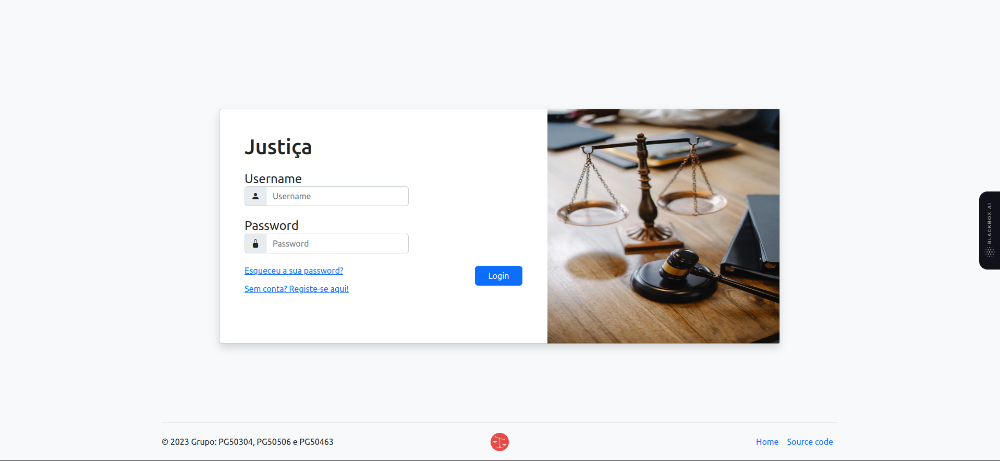

### Registo

Caso o utilizador não esteja registado, o *website* permite que o utilizador se registe, fornecendo os seus dados, como o nome, email, *password*, … Além disso contém um sistema de validação de dados, que verifica se os dados fornecidos pelo utilizador são válidos, e caso não sejam, o utilizador não consegue registar-se.

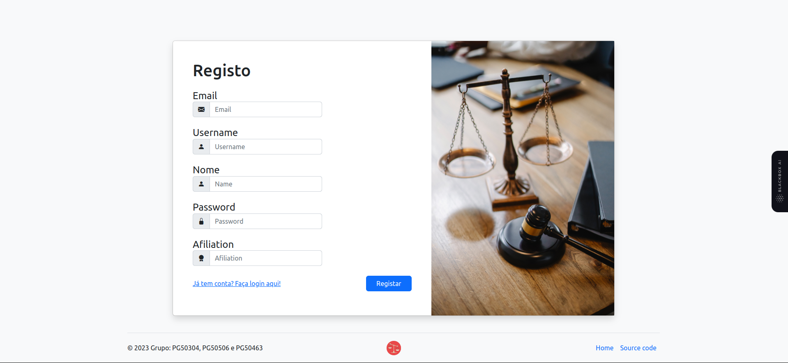

### Cabeçalho e rodapé

O *website* contém um cabeçalho e um rodapé, que estão presentes em todas as páginas do *website*.
O cabeçalho contém o logo do *website* e *links* para algumas páginas, o nível de acesso do utilizador e um botão que permite terminar a sessão.
O rodapé contém o nome dos autores do *website* e outros *links* que podem ser de uso.

### Página inicial

A *Homepage* do *website* contém  um sistema de pesquisa, que permite ao utilizador pesquisar por acórdãos, e filtrar os resultados da pesquisa. A tabela contém os dados dos acórdãos, e permite ao utilizador visualizar o acórdão, adicionar acórdãos aos seus favoritos, editar os dados dos acórdãos, bem como os apagar.

Estas operações são reservadas apenas a utilizadores de determinado nível:

- Utilizadores com nível de acesso Consumidor podem apenas visualizar e adicionar aos seus favoritos os acórdãos.

- Utilizadores com nível de acesso Produtor podem visualizar, adicionar aos seus favoritos, editar e adicionar os acórdãos.

- Utilizadores com nível de acesso Administrador podem visualizar, adicionar aos seus favoritos, editar, apagar e adicionar acórdãos.

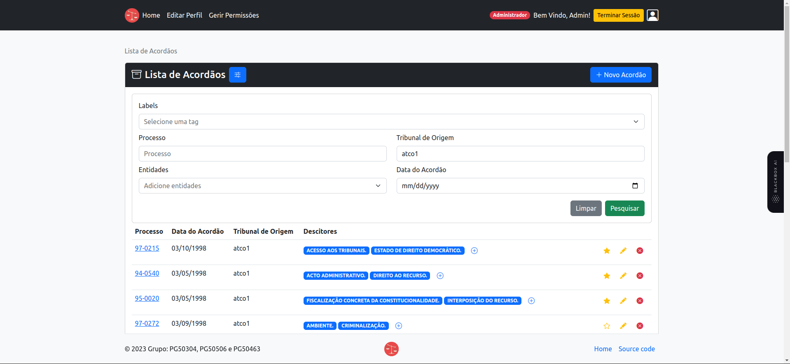

A tabela também contém um sistema de paginação, que permite ao utilizador navegar entre as páginas da tabela.

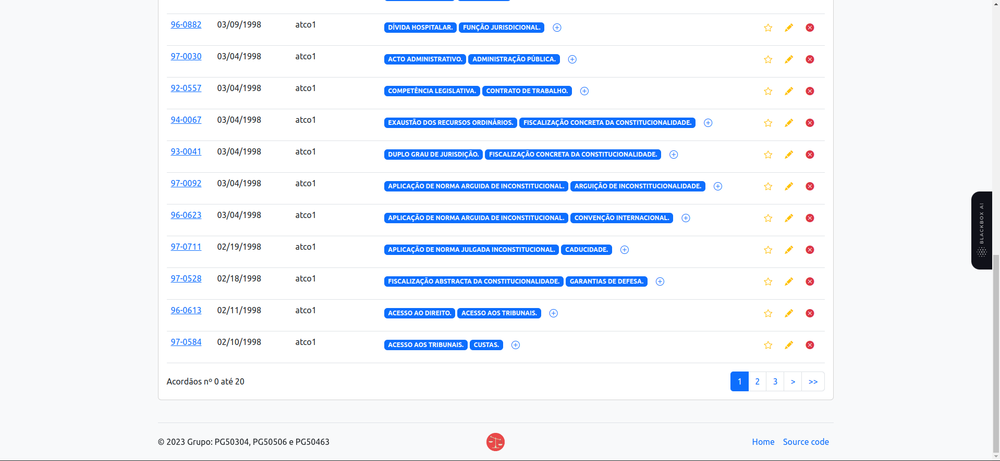


### Página do utilizador

A página do utilizador contém os dados do utilizador, bem como a mesma tabela da *homepage* com os acórdãos favoritos do utilizador. O utilizador visualizar os seus dados e pode seguir para a página de edição dos seus dados.

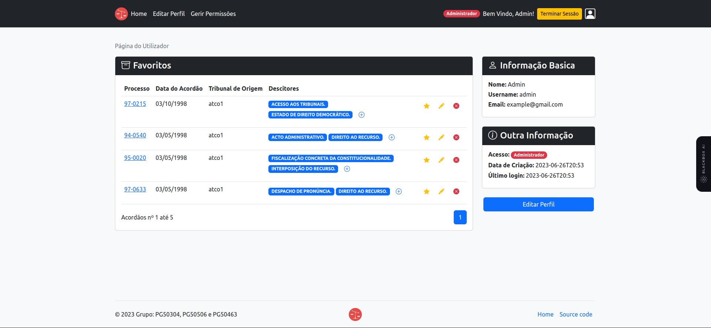

### Página de edição de dados do utilizador

A página de edição de dados do utilizador permite ao utilizador editar os seus dados, como o nome, email, *username*, …
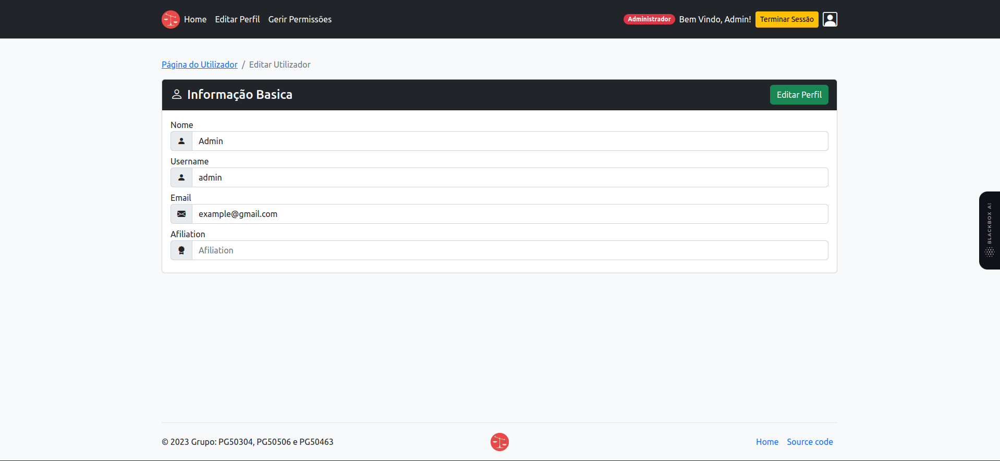


### Página de alteração de permissões

A página de alteração de permissões permite ao utilizador com nível de acesso Administrador alterar o nível de acesso de outros utilizadores.

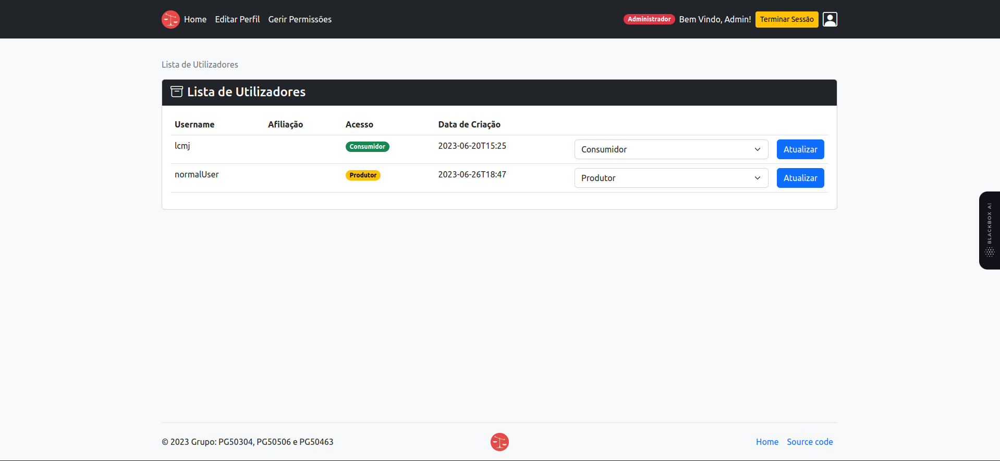

### Página de visualização de acórdãos

A página de visualização de acórdãos permite ao utilizador visualizar os dados de um acórdão, bem como adicionar o acórdão aos seus favoritos.

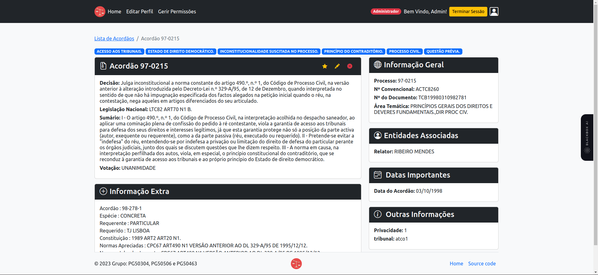

### Página de adição de acórdãos

A página de adição de acórdãos permite ao utilizador com nível de acesso Produtor adicionar acórdãos à base de dados.

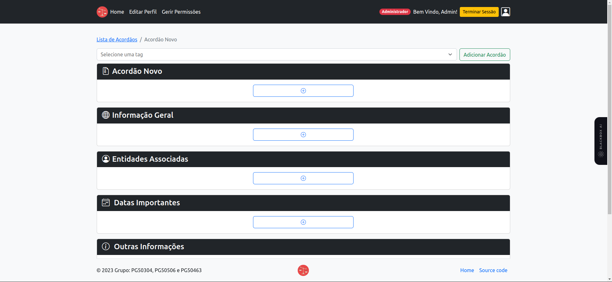

É totalmente dinâmica, e permite ao utilizador adicionar que campos considerar necessários.

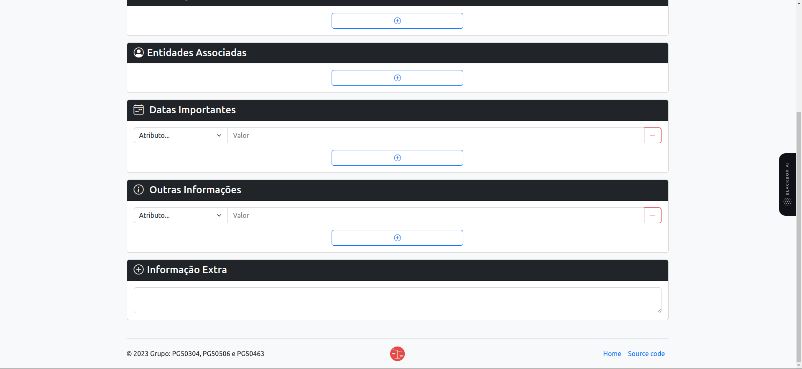

Ela contém um sistema de validação de dados, que verifica se os dados fornecidos pelo utilizador são válidos, e caso não sejam, o utilizador não consegue adicionar o acórdão.

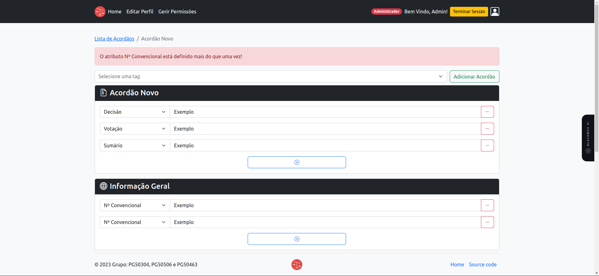

### Página de edição de acórdãos

A página de edição de acórdãos permite ao utilizador com nivel de acesso Produtor editar os acórdãos da base de dados. É muito similar à página de adição de acórdãos, mas já vem com os dados pré-preenchidos.

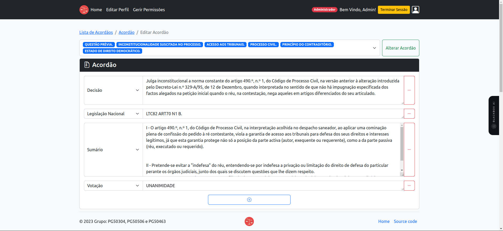
